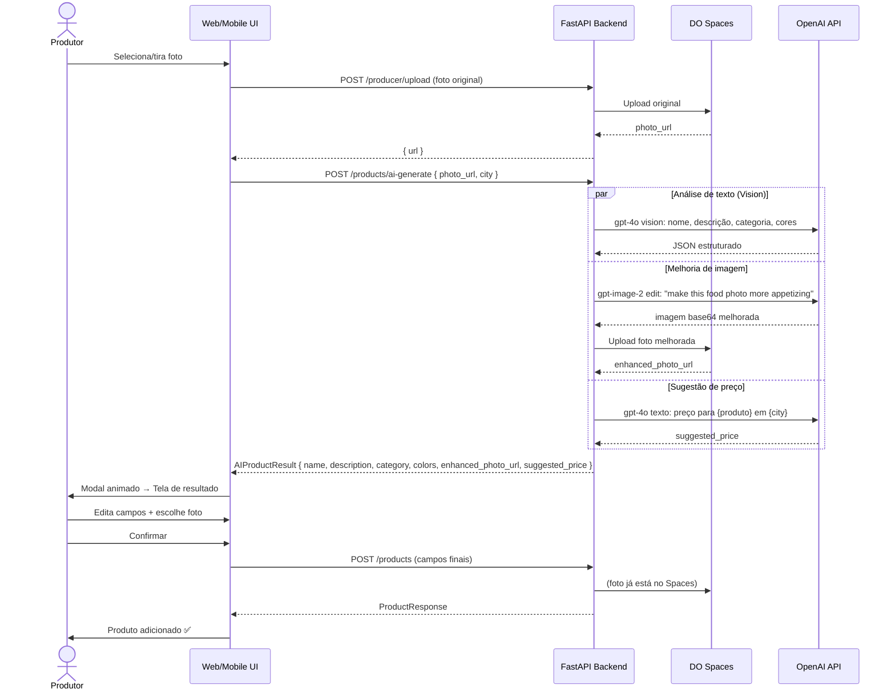

# Architecture — Cadastro Inteligente de Produto com IA

**Feature:** `ai-product-registration`  
**Data:** 2026-05-02

---

## Visão geral

### Antes
```
Produtor → Formulário manual → POST /products → MongoDB
```

### Depois
```
Produtor → Foto → POST /products/ai-generate → Pipeline OpenAI → Preview editável → POST /products → MongoDB
```

---

## Diagrama de fluxo



---

## Componentes afetados

### Backend (`/backend`)

#### Arquivos novos
| Arquivo | Responsabilidade |
|---------|-----------------|
| `routers/ai_products.py` | Endpoint `POST /products/ai-generate` — orquestra as chamadas OpenAI |
| `services/openai_service.py` | Abstração das chamadas OpenAI (vision, image edit, preço) |

#### Arquivos modificados
| Arquivo | Mudança |
|---------|---------|
| `models.py` | Adicionar `color_primary: Optional[str]`, `color_accent: Optional[str]` em `ProductCreate`, `ProductUpdate`, `ProductResponse` |
| `config.py` | Adicionar `openai_api_key: str = ""` |
| `main.py` | Registrar `ai_products.router` com prefix `/products` |
| `requirements.txt` | Adicionar `openai>=1.30.0` |

#### Contrato do endpoint

```
POST /products/ai-generate
Authorization: Bearer <token>
Content-Type: application/json

{
  "photo_url": "https://terraviva.nyc3.digitaloceanspaces.com/terraviva/profiles/xxx.jpg",
  "city": "Jaraguá do Sul"
}

→ 200 OK
{
  "name": "Queijo Colonial Curado",
  "description": "Feito artesanalmente...",
  "category": "queijos",
  "color_primary": "#D4A853",
  "color_accent": "#8B5E3C",
  "suggested_price": 28.00,
  "suggested_price_note": "Sugestão para feiras em Jaraguá do Sul, SC",
  "enhanced_photo_url": "https://...",
  "original_photo_url": "https://..."   ← mantém a original para o produtor comparar
}

→ 422 se photo_url inválida
→ 503 se OpenAI indisponível (com mensagem para tentar novamente)
```

#### Estratégia de chamadas paralelas

```python
# services/openai_service.py
async def analyze_product(photo_url: str, city: str) -> AIProductResult:
    async with asyncio.TaskGroup() as tg:
        text_task  = tg.create_task(analyze_with_vision(photo_url))
        image_task = tg.create_task(enhance_photo(photo_url))
        price_task = tg.create_task(suggest_price(photo_url, city))
    # merge results
```

> FastAPI suporta async endpoints nativamente. As 3 chamadas OpenAI serão disparadas em paralelo via `asyncio.gather`, reduzindo latência total de ~45s para ~20–25s.

---

### Web (`/web`)

#### Arquivos novos
| Arquivo | Responsabilidade |
|---------|-----------------|
| `src/components/AIProductModal.tsx` | Modal multi-step: upload → loading animado → resultado editável |
| `src/components/AIProductSteps.tsx` | Componente de animação de progresso (steps com ícones e mensagens) |

#### Arquivos modificados
| Arquivo | Mudança |
|---------|---------|
| `src/app/minha-banca/page.tsx` | Botão "+ Novo produto" abre sempre o fluxo IA; detecta `navigator.onLine` — se offline, abre formulário manual diretamente |
| `src/components/ProductCard.tsx` | Aceitar `color_primary?`, `color_accent?` como props opcionais; aplicar estilo dinâmico |
| `src/lib/types.ts` | Adicionar `color_primary`, `color_accent` em `Product` |
| `src/app/perfil/page.tsx` | Marcar `city` como obrigatório; geocode hint no campo address (debounce 800ms → GPT-4o mini) |

#### Estrutura do AIProductModal

```
AIProductModal
├── Step 1: PhotoPicker (galeria ou câmera)
│   └── <input type="file" accept="image/*" capture="environment">
│
├── Step 2: LoadingAnimation
│   └── Lista de steps com ícone + mensagem + status (pending/running/done)
│       Os steps atualizam via Server-Sent Events ou polling
│
└── Step 3: ResultEditor
    ├── ProductCardPreview (preview ao vivo com as cores da IA)
    ├── Campos editáveis: nome, descrição, categoria, preço
    ├── FotoComparison: [Original] | [IA] — botão toggle
    ├── PalettePreview: chips de cor + toggle aceitar/rejeitar
    └── Botões: [Salvar produto] [Cancelar → dialog]
```

#### Animação de Loading (UX tecnológico)

```tsx
const STEPS = [
  { icon: "📤", label: "Foto importada",              key: "upload"   },
  { icon: "🔍", label: "Identificando o produto...",   key: "vision"   },
  { icon: "✍️", label: "Gerando nome e descrição...", key: "text"     },
  { icon: "🏷️", label: "Escolhendo a categoria...",   key: "category" },
  { icon: "🎨", label: "Definindo identidade visual...", key: "colors" },
  { icon: "📸", label: "Melhorando a foto...",         key: "image"    },
  { icon: "💰", label: "Sugerindo o preço...",         key: "price"    },
]
```

Como a IA faz tudo em paralelo no backend, os steps da UI são **animados com delays artificiais** (staggered) para dar a sensação de progresso — o backend retorna tudo de uma vez, mas a UI revela cada passo progressivamente. Isso mantém a UX envolvente sem necessidade de streaming.

---

### Mobile (`/app`)

#### Arquivos novos
| Arquivo | Responsabilidade |
|---------|-----------------|
| `src/screens/producer/AIProductScreen.tsx` | Tela dedicada: foto → loading → resultado editável |
| `src/components/AIProductSteps.tsx` | Componente de animação (Animated.Value, sequência de steps) |

#### Arquivos modificados
| Arquivo | Mudança |
|---------|---------|
| `src/screens/producer/AddProductScreen.tsx` | Ao abrir: verifica `NetInfo.isConnected` — se online, navega direto para `AIProductScreen`; se offline, exibe formulário manual |
| `src/components/ProductCard.tsx` | Aceitar `color_primary?`, `color_accent?`; aplicar `borderColor` e `backgroundColor` dinâmicos |
| `src/screens/producer/ProfileScreen.tsx` | Campo `city` obrigatório + geocode hint no endereço |

#### Camera/Galeria no mobile

```tsx
// AIProductScreen.tsx
import * as ImagePicker from 'expo-image-picker';

// Galeria
const pickFromGallery = async () => {
  const result = await ImagePicker.launchImageLibraryAsync({
    mediaTypes: ImagePicker.MediaTypeOptions.Images,
    quality: 0.8,
    base64: false,
  });
  if (!result.canceled) handlePhoto(result.assets[0].uri);
};

// Câmera
const takePhoto = async () => {
  const result = await ImagePicker.launchCameraAsync({
    mediaTypes: ImagePicker.MediaTypeOptions.Images,
    quality: 0.8,
  });
  if (!result.canceled) handlePhoto(result.assets[0].uri);
};
```

---

### Shared types (`/shared`)

#### Arquivos modificados
| Arquivo | Mudança |
|---------|---------|
| `types/product.ts` | Adicionar `color_primary?: string`, `color_accent?: string` |

---

## Identidade visual por produto — ProductCard

### Lógica de cores

```tsx
// Se tem cores da IA, aplica identidade; senão, usa padrão
const cardStyle = color_primary ? {
  borderWidth: 2,
  borderColor: color_primary,
  backgroundColor: hexToRgba(color_primary, 0.06),  // fundo levíssimo
} : {};

const badgeStyle = color_accent ? {
  backgroundColor: hexToRgba(color_accent, 0.15),
  color: color_accent,
} : {};
```

### Paleta segura

A IA é instruída (prompt) a retornar apenas cores que:
- Tenham contraste suficiente com texto branco/escuro (legibilidade)
- Sejam tons naturais/terrosos coerentes com produtos de feira
- Não fujam drasticamente do design system verde (#2A5C2E) do Terra Viva

---

## Tratamento de erros e performance

| Cenário | Comportamento |
|---------|--------------|
| OpenAI timeout (>60s) | `503` com mensagem "IA demorou demais, tente novamente" — formulário manual continua disponível |
| Foto muito grande (>5MB) | Validação antes do upload, igual ao fluxo atual |
| Categoria não reconhecida | IA usa o prompt com a lista explícita das 12 categorias — retorna "outros" como fallback |
| `city` vazia no perfil | `suggested_price: null`, campo de preço em branco, tooltip "Complete sua cidade no perfil para receber sugestão de preço" |
| gpt-image-2 falha | `enhanced_photo_url: null` — UI mostra apenas foto original, sem bloquear o fluxo |
| `color_primary` inválido | Validação regex `/^#[0-9A-Fa-f]{6}$/` no backend antes de salvar |

---

## Dependências externas

| Pacote | Onde | Versão |
|--------|------|--------|
| `openai` | backend/requirements.txt | `>=1.30.0` |
| `expo-image-picker` | app/package.json | Já deve estar ou `~15.x` |
| `httpx` | backend | Já presente — usado para download da foto |

---

## Variáveis de ambiente

Adicionadas ao `.env` e `.env.example`:
```
OPENAI_API_KEY=sk-...
OPENAI_IMAGE_MODEL=gpt-image-2
OPENAI_VISION_MODEL=gpt-4o
```

---

## Trade-offs e alternativas

| Decisão | Alternativa descartada | Motivo |
|---------|----------------------|--------|
| IA sempre padrão, manual só offline | Botão de escolha "IA vs manual" | Reduza fricção — agricultor não precisa saber que existe IA, ela simplesmente acontece |
| Chamadas IA no backend | Direto do frontend | Segurança: chave OpenAI nunca exposta ao cliente |
| `asyncio.gather` para paralelismo | Chamadas sequenciais | Reduz latência percebida em ~50% |
| Steps animados com delay artificial | SSE/WebSocket real | Complexidade desnecessária; backend retorna tudo de uma vez |
| `gpt-image-2` para melhoria de foto | Stability AI / Cloudinary | Simplicidade: mesma SDK, mesma billing |
| Cores salvas no banco | Calculadas on-the-fly | Consistência visual: card sempre igual ao que foi aprovado |

---

## Consequências negativas (known trade-offs)

1. **Custo variável**: cada cadastro com IA custa ~$0.20–0.50. Com escala, pode se tornar relevante. Mitigação futura: rate limit por produtor ou plano de uso.
2. **Latência**: 20–30s de espera pelo pipeline. Mitigação: animação envolvente que transforma a espera em experiência.
3. **Qualidade da foto melhorada**: `gpt-image-2` pode mudar substancialmente a composição. Mitigação: produtor sempre vê comparação e escolhe qual foto usar.
4. **Dependência de internet**: mobile sem conexão não consegue usar IA. Mitigação: formulário manual sempre acessível.

---

## Lista de arquivos a criar/modificar

### Criar
- `backend/routers/ai_products.py`
- `backend/services/openai_service.py`
- `web/src/components/AIProductModal.tsx`
- `web/src/components/AIProductSteps.tsx`
- `app/src/screens/producer/AIProductScreen.tsx`
- `app/src/components/AIProductSteps.tsx`

### Modificar
- `backend/models.py` — campos `color_primary`, `color_accent`
- `backend/config.py` — `openai_api_key`, modelos
- `backend/main.py` — registrar router
- `backend/requirements.txt` — `openai`
- `backend/routers/products.py` — campos novos no CRUD
- `web/src/components/ProductCard.tsx` — cores dinâmicas
- `web/src/lib/types.ts` — campos novos em `Product`
- `web/src/app/minha-banca/page.tsx` — botão IA + integrar modal
- `web/src/app/perfil/page.tsx` — cidade obrigatória + geocode hint
- `app/src/components/ProductCard.tsx` — cores dinâmicas
- `app/src/screens/producer/AddProductScreen.tsx` — hub manual/IA
- `app/src/screens/producer/ProfileScreen.tsx` — cidade obrigatória
- `shared/types/product.ts` — campos novos
- `.env.example` / `.env.develop.example` — variáveis OpenAI
