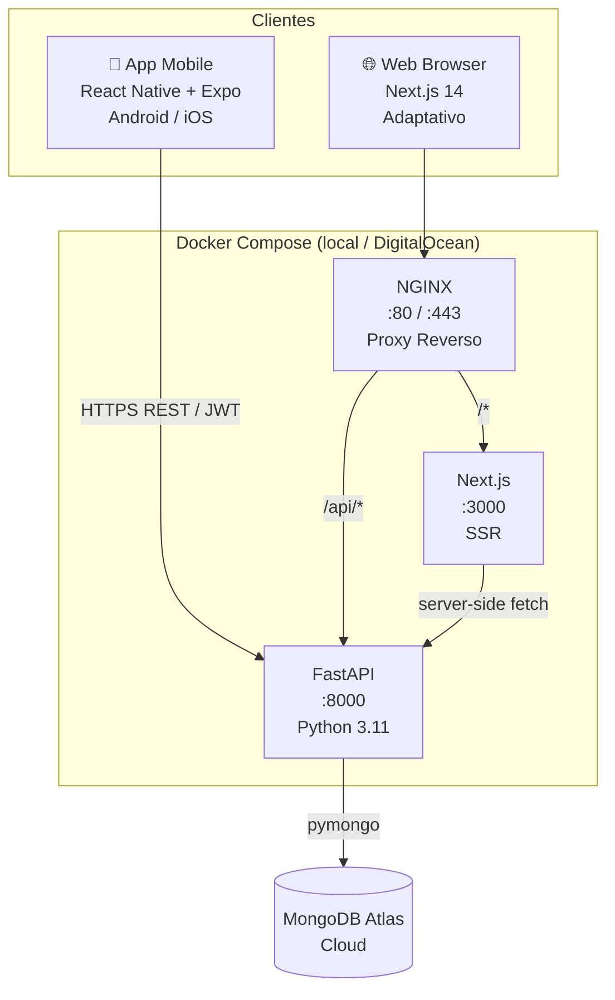

# Architecture — Monorepo Base (Terra Viva)

## Visão Geral do Sistema

### Antes (estado atual)
```
terraVivaDev/
├── docs/     ← apenas documentação
└── spec_to_code/  ← submodule de ferramentas
```

### Depois (estado alvo desta feature)
```
terraVivaDev/
├── backend/          ← FastAPI + Python 3.11
├── web/              ← Next.js 14 App Router
├── app/              ← React Native + Expo
├── shared/           ← Tipos TypeScript
├── nginx/            ← Proxy reverso
├── docker-compose.yml
├── docker-compose.prod.yml
├── .env.example
├── Makefile
└── docs/
```

---

## Diagrama de Componentes



---

## Estrutura de Pastas Detalhada

```
terraVivaDev/
│
├── backend/
│   ├── main.py                  # App FastAPI + registro de routers
│   ├── config.py                # Variáveis de ambiente (pydantic-settings)
│   ├── database.py              # Conexão MongoDB (singleton)
│   ├── models.py                # Schemas Pydantic (request/response)
│   ├── utils.py                 # JWT, OTP, formatação de telefone
│   ├── dependencies.py          # get_current_user, require_role
│   ├── routers/
│   │   ├── auth.py              # POST /auth/request-otp, /auth/verify-otp
│   │   ├── bancas.py            # GET /bancas, /bancas/{id}
│   │   ├── products.py          # CRUD de produtos (producer)
│   │   ├── reservations.py      # CRUD de reservas
│   │   ├── producers.py         # Perfil do produtor
│   │   └── fair_config.py       # Configuração do tenant
│   ├── requirements.txt
│   ├── Dockerfile
│   └── .env.example
│
├── web/
│   ├── src/
│   │   ├── app/                 # Next.js App Router
│   │   │   ├── layout.tsx       # Layout raiz (providers, fontes)
│   │   │   ├── page.tsx         # Home — lista de bancas
│   │   │   ├── banca/
│   │   │   │   └── [id]/
│   │   │   │       └── page.tsx # Detalhe da banca
│   │   │   ├── pedidos/
│   │   │   │   └── page.tsx     # Meus pedidos (consumer)
│   │   │   ├── login/
│   │   │   │   └── page.tsx     # Login OTP
│   │   │   └── admin/
│   │   │       ├── layout.tsx   # Layout do painel admin
│   │   │       ├── page.tsx     # Dashboard do parceiro
│   │   │       └── feira/
│   │   │           └── page.tsx # Configurar calendário
│   │   ├── components/
│   │   │   ├── ui/              # Componentes base (Button, Input, Badge)
│   │   │   ├── BancaCard.tsx
│   │   │   ├── ProductCard.tsx
│   │   │   ├── FairStatusBanner.tsx
│   │   │   ├── Header.tsx
│   │   │   └── OrderStatusBadge.tsx
│   │   ├── lib/
│   │   │   ├── api.ts           # Cliente HTTP (fetch wrapper)
│   │   │   └── auth.ts          # Cookie httpOnly, session
│   │   └── styles/
│   │       └── globals.css      # Tokens do design system como CSS vars
│   ├── tailwind.config.ts       # Tokens → classes Tailwind
│   ├── next.config.ts
│   ├── package.json
│   ├── Dockerfile
│   └── .env.example
│
├── app/
│   ├── src/
│   │   ├── screens/
│   │   │   ├── consumer/
│   │   │   │   ├── HomeScreen.tsx
│   │   │   │   ├── BancaScreen.tsx
│   │   │   │   ├── CheckoutScreen.tsx
│   │   │   │   └── OrdersScreen.tsx
│   │   │   ├── producer/
│   │   │   │   ├── DashboardScreen.tsx
│   │   │   │   ├── ProductsScreen.tsx
│   │   │   │   ├── AddProductScreen.tsx
│   │   │   │   └── ProfileScreen.tsx
│   │   │   └── auth/
│   │   │       ├── PhoneScreen.tsx
│   │   │       └── OtpScreen.tsx
│   │   ├── components/
│   │   │   ├── BancaCard.tsx
│   │   │   ├── ProductCard.tsx
│   │   │   ├── CategoryChip.tsx
│   │   │   ├── OrderStatusBadge.tsx
│   │   │   ├── FairStatusBanner.tsx
│   │   │   └── Button.tsx
│   │   ├── navigation/
│   │   │   ├── RootNavigator.tsx   # Auth vs. App split
│   │   │   ├── ConsumerTabs.tsx    # Bottom tabs do consumidor
│   │   │   └── ProducerTabs.tsx    # Bottom tabs do produtor
│   │   ├── context/
│   │   │   ├── AuthContext.tsx     # Estado global de auth
│   │   │   └── TenantContext.tsx   # Branding do parceiro
│   │   ├── services/
│   │   │   ├── api.ts              # Axios client com interceptors
│   │   │   ├── auth.ts             # Token (SecureStore), login/logout
│   │   │   └── sync.ts             # Queue offline + processamento
│   │   ├── storage/
│   │   │   ├── queue.ts            # Fila de operações offline
│   │   │   └── cache.ts            # Cache local (TTL 30min)
│   │   └── theme/
│   │       └── tokens.ts           # Design tokens centralizados
│   ├── App.tsx                     # Entry point + NavigationContainer
│   ├── app.json                    # Config Expo
│   ├── eas.json                    # Perfis de build (dev/preview/prod)
│   ├── package.json
│   └── tsconfig.json
│
├── shared/
│   ├── types/
│   │   ├── user.ts
│   │   ├── banca.ts
│   │   ├── product.ts
│   │   ├── reservation.ts
│   │   └── fair-config.ts
│   └── package.json              # name: "@terra-viva/shared"
│
├── nginx/
│   ├── nginx.conf
│   └── conf.d/
│       └── terra-viva.conf
│
├── docker-compose.yml
├── docker-compose.prod.yml
├── .env.example
└── Makefile
```

---

## Backend — Decisões de Arquitetura

### Routers por domínio (não tudo em main.py)

```python
# main.py
app.include_router(auth.router,         prefix="/auth",        tags=["Auth"])
app.include_router(bancas.router,       prefix="/bancas",      tags=["Bancas"])
app.include_router(products.router,     prefix="/products",    tags=["Produtos"])
app.include_router(reservations.router, prefix="/reservations",tags=["Reservas"])
app.include_router(producers.router,    prefix="/producer",    tags=["Produtor"])
app.include_router(fair_config.router,  prefix="/fair-config", tags=["Config Feira"])
```

### Autenticação — Fluxo JWT + OTP

```
[POST /auth/request-otp]
  → valida formato do celular
  → gera código 6 dígitos
  → salva em otp_codes (TTL 5min via MongoDB index)
  → em dev: loga no console
  → em prod: envia via Twilio

[POST /auth/verify-otp]
  → busca otp_codes por phone + code
  → se não existe ou expirou → 401
  → se existe → deleta o código
  → busca ou cria user em users
  → retorna JWT (HS256, 30min)

[Dependência: get_current_user]
  → extrai Bearer token do header
  → decodifica JWT
  → retorna user ou 401
```

### Modelos Pydantic — Campos críticos

```python
class ProducerProfile(BaseModel):
    bio: str
    photo_url: Optional[str]
    gallery: List[str] = []
    city: str
    payment_methods: List[str] = ["cash"]  # cash | pix | card
    pix_key: Optional[str] = None
    address: Optional[str] = None

class ReservationCreate(BaseModel):
    product_id: str
    quantity: int = Field(ge=1)
    pickup_location: Literal["feira", "produtor"]
    payment_intent: Literal["cash", "pix", "card"]

class FairConfig(BaseModel):
    name: str
    city: str
    logo_url: Optional[str]
    primary_color: str = "#2A5C2E"
    secondary_color: str = "#F7F3EC"
    fair_day: str           # "saturday"
    fair_start_time: str    # "08:00"
    fair_end_time: str      # "12:00"
    fair_location: str
    order_window_open: str  # "monday 07:00"
    order_window_close: str # "friday 18:00"
    active: bool = True
```

### CORS

Em dev: permite `localhost:3000` (web) e o IP local (app Expo).  
Em prod: apenas o domínio final.

---

## Web (Next.js 14) — Decisões

### App Router + Server Components

- Dados públicos (bancas, produtos) → `fetch` no servidor (Server Component) — SEO + performance
- Dados privados (pedidos, perfil) → Client Component com SWR
- Autenticação → cookie httpOnly via `next-auth` ou implementação própria simples

### Tailwind + Design Tokens

Tokens do design system mapeados como variáveis CSS e classes Tailwind:

```ts
// tailwind.config.ts
colors: {
  primary: '#2A5C2E',
  'primary-medium': '#3D7A42',
  'primary-light': '#10B981',
  background: '#F7F3EC',
  surface: '#FFFFFF',
  amber: '#F59E0B',
}
```

### Web Adaptativa

- Mobile first — layout funciona perfeitamente em telas de 375px
- Sem app separado para mobile browser — mesma interface responsiva
- Bottom navigation no mobile browser (posição fixed, igual ao app)

---

## App Mobile — Decisões

### Expo SDK (Managed Workflow)

- Managed Workflow — sem ejetar para bare
- iOS e Android desde o início — nenhum componente `Platform.select` desnecessário
- EAS Build para gerar APK (Android) e IPA (iOS) quando chegar a hora

### Navegação (React Navigation v6)

```
RootNavigator
├── AuthStack (não logado)
│   ├── PhoneScreen
│   └── OtpScreen
└── AppStack (logado)
    ├── ConsumerTabs (role === "consumer")
    │   ├── HomeScreen
    │   ├── OrdersScreen
    │   └── ProfileScreen
    └── ProducerTabs (role === "producer")
        ├── DashboardScreen
        ├── ProductsScreen
        └── ProfileScreen
```

### Estado Global

- **AuthContext** → token JWT, user, role, login(), logout()
- **TenantContext** → branding do parceiro (cores, logo, nome da feira)
- Sem Redux/Zustand — React Context é suficiente para este escopo

### Design Tokens Centralizados

`app/src/theme/tokens.ts` — única fonte de verdade para cores, espaçamentos, tipografia, sombras, border radius. Todos os componentes importam daqui.

### Offline-First

- Cache local: `AsyncStorage` com TTL de 30 minutos
- Fila de sync: operações offline gravadas localmente, processadas ao voltar online
- NetInfo listener: detecta reconexão e dispara `processQueue()`

---

## Shared — Tipos TypeScript

Pacote local `@terra-viva/shared` referenciado via path alias em ambos `web/` e `app/`.

```ts
// shared/types/reservation.ts
export interface Reservation {
  _id: string
  consumer_id: string
  product_id: string
  producer_id: string
  product_name: string
  quantity: number
  total_price: number
  pickup_location: 'feira' | 'produtor'
  payment_intent: 'cash' | 'pix' | 'card'
  status: 'pending' | 'confirmed' | 'collected' | 'cancelled'
  created_at: string
  updated_at: string
}
```

---

## Docker Compose (Desenvolvimento)

```
docker compose up
  ↓
nginx     :80        → proxy para backend (/api) e web (/)
backend   :8000      → FastAPI com --reload (hot reload via volume)
web       :3000      → Next.js dev server
```

MongoDB não sobe em container — usa Atlas direto pela string de conexão no `.env`.

### .env.example

```env
# MongoDB Atlas
MONGODB_URL=mongodb+srv://...

# JWT
SECRET_KEY=troque-isso-em-producao
ALGORITHM=HS256
ACCESS_TOKEN_EXPIRE_MINUTES=30

# CORS (web local em dev)
CORS_ORIGINS=http://localhost:3000

# App (Expo)
EXPO_PUBLIC_API_URL=http://localhost:8000

# Next.js
NEXT_PUBLIC_API_URL=http://localhost:8000
```

---

## Makefile — Comandos

```makefile
dev:        docker compose up --build
stop:       docker compose down
logs:       docker compose logs -f
restart:    docker compose restart
ps:         docker compose ps
app:        cd app && npx expo start
```

---

## Dependências Externas

### Backend
| Pacote | Versão | Uso |
|---|---|---|
| fastapi | ^0.115 | Framework web |
| uvicorn | ^0.34 | Servidor ASGI |
| pymongo | ^4.10 | Driver MongoDB |
| python-jose | ^3.3 | JWT |
| passlib[bcrypt] | ^1.7 | Hash de senhas |
| pydantic-settings | ^2.7 | Config via .env |
| python-multipart | ^0.0.20 | Upload de arquivos |

### Web
| Pacote | Uso |
|---|---|
| next 15 | Framework |
| react 19 | UI |
| tailwindcss 4 | Estilos |
| swr | Cache e fetch client-side |
| axios | HTTP client |

### App
| Pacote | Uso |
|---|---|
| expo (SDK 53) | Plataforma |
| react-navigation/native | Navegação |
| react-navigation/bottom-tabs | Tab bar |
| expo-secure-store | Token JWT seguro |
| @react-native-async-storage/async-storage | Cache e fila offline |
| @react-native-community/netinfo | Detectar conectividade |
| axios | HTTP client |
| @expo/vector-icons | Feather Icons |

---

## Restrições e Suposições

| Item | Decisão |
|---|---|
| MongoDB | Atlas cloud — sem container local |
| SMS / OTP | Console em dev; Twilio na fase 2 |
| Upload de fotos | Endpoint preparado, storage local em dev (fase 2: S3/Spaces) |
| Auth web | Implementação própria simples (cookie httpOnly) — sem NextAuth por ora |
| SSL/HTTPS | NGINX com Let's Encrypt — apenas em produção |
| Expo | Managed Workflow — sem ejetar |

---

## Trade-offs

| Trade-off | Escolha | Alternativa descartada | Motivo |
|---|---|---|---|
| Estilos no app | StyleSheet nativo + tokens | NativeWind / Styled Components | Performance nativa, menos dependências |
| Estado global | React Context | Zustand / Redux | Complexidade desnecessária para este escopo |
| Auth web | Cookie httpOnly próprio | NextAuth.js | Evitar overhead de configuração de providers |
| Tipagem compartilhada | Pacote local `shared/` | Duplicação ou geração de código | Única fonte de verdade sem build complexo |

---

## Consequências Negativas (a monitorar)

- **Tipos compartilhados via path alias** → funciona em dev, mas precisa de cuidado na hora do EAS Build (configurar `tsconfig.json` paths corretamente)
- **MongoDB Atlas em dev** → depende de internet; criar seed script para dados de teste minimiza impacto
- **Expo Managed** → algumas libs nativas não são suportadas; se precisar de funcionalidade muito específica de plataforma, pode exigir migration para Bare later

---

## Arquivos Principais a Criar

| Arquivo | Descrição |
|---|---|
| `backend/main.py` | App FastAPI + registro de routers + CORS |
| `backend/config.py` | Configuração via pydantic-settings |
| `backend/database.py` | Singleton de conexão MongoDB |
| `backend/models.py` | Todos os schemas Pydantic |
| `backend/utils.py` | JWT, OTP, helpers |
| `backend/dependencies.py` | `get_current_user`, `require_role` |
| `backend/routers/*.py` | 6 routers: auth, bancas, products, reservations, producers, fair_config |
| `backend/Dockerfile` | Python 3.11-slim + uvicorn |
| `backend/requirements.txt` | Dependências Python |
| `web/src/app/layout.tsx` | Layout raiz com Tailwind + providers |
| `web/src/app/page.tsx` | Home — lista de bancas |
| `web/tailwind.config.ts` | Tokens do design system |
| `web/Dockerfile` | Node 20-alpine + standalone |
| `app/App.tsx` | Entry point + NavigationContainer |
| `app/src/navigation/RootNavigator.tsx` | Auth vs. App split |
| `app/src/context/AuthContext.tsx` | Estado global de auth |
| `app/src/theme/tokens.ts` | Design tokens |
| `app/src/services/api.ts` | Axios client |
| `shared/types/*.ts` | Interfaces TypeScript |
| `nginx/conf.d/terra-viva.conf` | Roteamento /api vs / |
| `docker-compose.yml` | Orquestração dev |
| `.env.example` | Template de variáveis |
| `Makefile` | Comandos de desenvolvimento |
